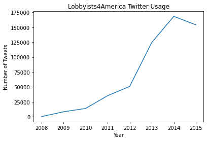
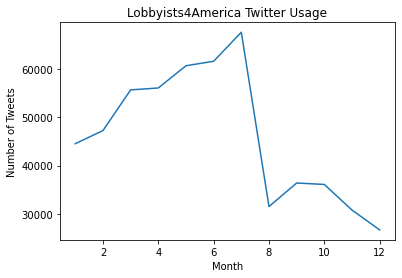
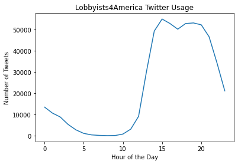
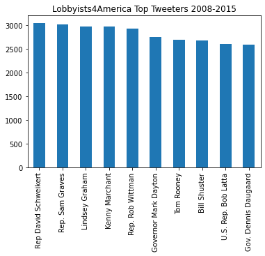
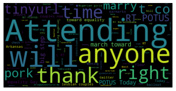
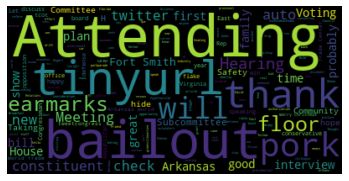
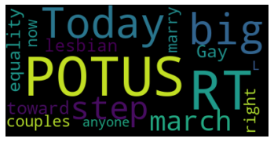

## This Jupyter notebook is an exploratory analysis of Lobbyists4America twitter data made for the Coursera SQL class, module 4 assignment 2. The assignment is outlined as follows:

1) Provide a summary of the different descriptive statistics you looked at and WHY.
* I looked at tweet trends over time: By year, month, time of day
    - I wanted to see how tweet patterns changed over time, both in the long and short term
* Top tweeters? Top tweeters by year?
    - Who are the top tweeters on the platform and are the top tweeters the same each year? 
* Top retweets?
    - What tweets had the most engagement and what did they say?
    
2) Submit 2-3 key points you may have discovered about the data, e.g. new relationships? Aha's! Did you come up with additional ideas for other things to review?

* Tweet trends over time: By year, month, time of day
    - Year: It looks like my import ened up truncating my dataset from 2008-2017 down to 2008-2015. In the interest of time, I won't worry too much about it here since the jupyter notebook I'm using has a weird data limit of 100Mb
    - Month: There seems to be a pattern of high twitter use until August, where the number of tweets falls off drastically
    - Hour: People seem to start tweeting around noon, and it continues to rise before plateuing around 3 pm and droppping at 8 pm.

* Top tweeters? Top tweeters by year?
     - Top 5 tweeters from 2008-2015 are 
        1) David Schweikert
        2) Sam Graves
        3) Lindey Graham
        4) Kenny Marchant
        5) Rob Wittman

    - The top tweeters change each year

* Top retweets?
    - There are two retweets with around 3.5M retweets, way higher than any other tweet. Turns out it's that Celeb selfie "RT @TheEllenShow: If only Bradley's arm was longer. Best photo ever. #oscars http://t.co/C9U5NOtGap"
    - An issue popped up here: The two retweets with 3.5M are the same tweet, but appeared twice in my search. I may need to remove duplicated tweets/retweets, but it may also be useful in the wordcloud to have the duplicates since they act as a sort of weighted average for engagement with each tweet. 

    - The wordcloud suggests the top tweets talk about attending events, include a tinyurl link, ideas linked to marriage, POTUS, and equality also pop up in the top tweets. 
    - If we break it up a bit by year, 2008 had a lot of mentions about bailouts, likely due to the economic recession in the late 2000's. In 2012, there was a lot mor talk about budgets, and a bunch of tweets mentioning the candidates: Barack Obama and Mitt Romney. Interestingly there's also a lot of mentions of DietCokeUS, PBS, and neil(degras?)tyson. Unfortunately, my dataset was truncated due to limitations in databricks data export, so I didn't looks at the 2016 cycle, however, the wordcloud did capture tweets supporting the 2015 decision to legalize gay marriage.

3) Did you prove or disprove any of your initial hypotheses? If so, which one and what do you plan to do next?
    - I don't think anything was really proven or disproven here as there wasn't much to prove. Many of the metrics I tried (e.g., top tweets, retweets) were drowned out by viral tweets, so removing those may reveal more politically motivated tweets and engagement with those would be more interesting for our purposes. However, we can say that jumping on the bandwagon of retweeting popular things might be a way for your brand to get noticed.


4) What additional questions are you seeking to answer?

    - What does the interaction/followers network of users look like?
    - Do certain states engage with twitter more than others?
    - Why is "Attending" the most used word? It's not used in the most retweeted tweet, so it must be either used in other wildly popular tweets or in many tweets in aggregate.


```python
import pandas as pd
import numpy as np
import matplotlib.pyplot as plt
import plotly.express as px
import PIL as PIL
from wordcloud import WordCloud, STOPWORDS, ImageColorGenerator
import zipfile

from pandasql import sqldf
pysqldf = lambda q: sqldf(q, globals())
```


```python
zf = zipfile.ZipFile('/home/jovyan/work/tweets_clean.zip') 
tweets = pd.read_csv(zf.open('tweets_clean.csv'))

users = pd.read_csv('/home/jovyan/work/users_clean.csv')
```

### Tweet trends over time: By year, month, time of day

#### Need to refactor our date info into a timestamp format


```python
tweets["created_at"] = tweets["created_at"].replace("T|Z", " ", regex=True)
```


```python
tweets["created_at"] = pd.to_datetime(tweets["created_at"], errors='coerce', format='%Y-%m-%d %H:%M:%S')
```


```python
tweets["created_at"]
```


    0        2008-08-04 17:28:51
    1        2008-08-06 19:04:45
    2        2008-08-06 20:35:36
    3        2008-08-07 13:52:52
    4        2008-08-07 15:12:05
                     ...        
    554875   2015-08-05 20:27:08
    554876   2015-08-05 20:28:02
    554877   2015-08-05 20:28:28
    554878   2015-08-05 20:28:38
    554879                   NaT
    Name: created_at, Length: 554880, dtype: datetime64[ns]


#### Let's aggregate the number of tweets by year, then month, then time of day


```python
tweets['year'] = pd.DatetimeIndex(tweets["created_at"]).year
tweets['month'] = pd.DatetimeIndex(tweets["created_at"]).month
tweets['hour'] = pd.DatetimeIndex(tweets["created_at"]).hour
```

##### Start with tweets by year
###### It looks like my import ened up truncating my dataset from 2008-2017 down to 2008-2015. In the interest of time, I won't worry too much about it here since the jupyter notebook I'm using has a weird data limit of 100Mb


```python
s = tweets['year'] .value_counts().sort_index()
year_plot = s.plot(title = "Lobbyists4America Twitter Usage")
year_plot.set_xlabel("Year")
year_plot.set_ylabel("Number of Tweets")
```


    Text(0, 0.5, 'Number of Tweets')





#### Tweets by Month


```python
s = tweets['month'] .value_counts().sort_index()
month_plot = s.plot(title = "Lobbyists4America Twitter Usage")
month_plot.set_xlabel("Month")
month_plot.set_ylabel("Number of Tweets")
```


    Text(0, 0.5, 'Number of Tweets')





#### Tweets by hour


```python
s = tweets['hour'] .value_counts().sort_index()
hour_plot = s.plot(title = "Lobbyists4America Twitter Usage")
hour_plot.set_xlabel("Hour of the Day")
hour_plot.set_ylabel("Number of Tweets")
```


    Text(0, 0.5, 'Number of Tweets')





#### Top tweeters? Top tweeters by year?


```python
sn = pysqldf("""
            SELECT 
                tweets.user_id,
                tweets.text,
                tweets.retweet_count,
                tweets.year,
                users.name
            FROM tweets
            JOIN users ON
            tweets.user_id = users.id            
            """)
sn = sn.drop_duplicates()
```


```python
t = sn['name'].value_counts().sort_index().sort_values(ascending=False)
t_sub = t[:10]
tweet_id_plot = t_sub.plot.bar(title = "Lobbyists4America Top Tweeters 2008-2015")
```





```python
tweets_year_user = pysqldf("""
                    SELECT
                        COUNT(*) AS count,
                        year,
                        name,
                        RANK() OVER(PARTITION BY year ORDER BY COUNT(*) DESC) AS rank
                    FROM sn
                    GROUP BY year, name
                    """)
```


```python
tweets_top_year = pysqldf("""
                    SELECT
                        *
                    FROM tweets_year_user
                    WHERE rank <= 5
                    AND year IS NOT NULL
                    """)
```


```python
fig = px.bar(tweets_top_year, x = 'name', y = 'count', facet_col='year')
fig.update_xaxes(matches=None)
```


<div>                            <div id="0f9b2bb8-3c29-41e2-a06f-3d66e441b9be" class="plotly-graph-div" style="height:525px; width:100%;"></div>            <script type="text/javascript">                require(["plotly"], function(Plotly) {                    window.PLOTLYENV=window.PLOTLYENV || {};                                    if (document.getElementById("0f9b2bb8-3c29-41e2-a06f-3d66e441b9be")) {                    Plotly.newPlot(                        "0f9b2bb8-3c29-41e2-a06f-3d66e441b9be",                        [{"alignmentgroup":"True","hovertemplate":"year=2008.0\u003cbr\u003ename=%{x}\u003cbr\u003ecount=%{y}\u003cextra\u003e\u003c\u002fextra\u003e","legendgroup":"","marker":{"color":"#636efa","pattern":{"shape":""}},"name":"","offsetgroup":"","orientation":"v","showlegend":false,"textposition":"auto","x":["Senator John Boozman","Rep. Jim Jordan","Jeff Flake","Earl Blumenauer","Henry McMaster"],"xaxis":"x","y":[43,26,25,12,5],"yaxis":"y","type":"bar"},{"alignmentgroup":"True","hovertemplate":"year=2009.0\u003cbr\u003ename=%{x}\u003cbr\u003ecount=%{y}\u003cextra\u003e\u003c\u002fextra\u003e","legendgroup":"","marker":{"color":"#636efa","pattern":{"shape":""}},"name":"","offsetgroup":"","orientation":"v","showlegend":false,"textposition":"auto","x":["Mike Capuano","Henry McMaster","Chellie Pingree","Bill Posey","Steve King"],"xaxis":"x2","y":[599,595,492,474,370],"yaxis":"y2","type":"bar"},{"alignmentgroup":"True","hovertemplate":"year=2010.0\u003cbr\u003ename=%{x}\u003cbr\u003ecount=%{y}\u003cextra\u003e\u003c\u002fextra\u003e","legendgroup":"","marker":{"color":"#636efa","pattern":{"shape":""}},"name":"","offsetgroup":"","orientation":"v","showlegend":false,"textposition":"auto","x":["Jerry Brown","Rep. Mike Coffman","Bill Shuster","Mike Rogers","Henry McMaster"],"xaxis":"x3","y":[827,690,636,529,513],"yaxis":"y3","type":"bar"},{"alignmentgroup":"True","hovertemplate":"year=2011.0\u003cbr\u003ename=%{x}\u003cbr\u003ecount=%{y}\u003cextra\u003e\u003c\u002fextra\u003e","legendgroup":"","marker":{"color":"#636efa","pattern":{"shape":""}},"name":"","offsetgroup":"","orientation":"v","showlegend":false,"textposition":"auto","x":["Rep. Rob Wittman","Rep David Schweikert","Kenny Marchant","Rep. Bob Gibbs","Jeff Denham"],"xaxis":"x4","y":[1103,800,779,684,684],"yaxis":"y4","type":"bar"},{"alignmentgroup":"True","hovertemplate":"year=2012.0\u003cbr\u003ename=%{x}\u003cbr\u003ecount=%{y}\u003cextra\u003e\u003c\u002fextra\u003e","legendgroup":"","marker":{"color":"#636efa","pattern":{"shape":""}},"name":"","offsetgroup":"","orientation":"v","showlegend":false,"textposition":"auto","x":["Kenny Marchant","Senator Mazie Hirono","Governor Mark Dayton","Kim Reynolds","JayInslee"],"xaxis":"x5","y":[1442,1428,1216,1215,1070],"yaxis":"y5","type":"bar"},{"alignmentgroup":"True","hovertemplate":"year=2013.0\u003cbr\u003ename=%{x}\u003cbr\u003ecount=%{y}\u003cextra\u003e\u003c\u002fextra\u003e","legendgroup":"","marker":{"color":"#636efa","pattern":{"shape":""}},"name":"","offsetgroup":"","orientation":"v","showlegend":false,"textposition":"auto","x":["Matt Cartwright","Rep. Sam Graves","Scott DesJarlais","Steve Pearce","Rep. Chris Collins"],"xaxis":"x6","y":[1585,1534,1329,1288,1282],"yaxis":"y6","type":"bar"},{"alignmentgroup":"True","hovertemplate":"year=2014.0\u003cbr\u003ename=%{x}\u003cbr\u003ecount=%{y}\u003cextra\u003e\u003c\u002fextra\u003e","legendgroup":"","marker":{"color":"#636efa","pattern":{"shape":""}},"name":"","offsetgroup":"","orientation":"v","showlegend":false,"textposition":"auto","x":["Darrell Issa","Rep. Sam Graves","James Comer","Brad Wenstrup","Mark Meadows"],"xaxis":"x7","y":[1687,1445,1346,1183,1170],"yaxis":"y7","type":"bar"},{"alignmentgroup":"True","hovertemplate":"year=2015.0\u003cbr\u003ename=%{x}\u003cbr\u003ecount=%{y}\u003cextra\u003e\u003c\u002fextra\u003e","legendgroup":"","marker":{"color":"#636efa","pattern":{"shape":""}},"name":"","offsetgroup":"","orientation":"v","showlegend":false,"textposition":"auto","x":["Elijah E. Cummings","Kevin McCarthy","Steve Bullock","Rep. Tony C\u00e1rdenas","U.S. Rep. Billy Long"],"xaxis":"x8","y":[1234,1133,1083,954,912],"yaxis":"y8","type":"bar"}],                        {"template":{"data":{"histogram2dcontour":[{"type":"histogram2dcontour","colorbar":{"outlinewidth":0,"ticks":""},"colorscale":[[0.0,"#0d0887"],[0.1111111111111111,"#46039f"],[0.2222222222222222,"#7201a8"],[0.3333333333333333,"#9c179e"],[0.4444444444444444,"#bd3786"],[0.5555555555555556,"#d8576b"],[0.6666666666666666,"#ed7953"],[0.7777777777777778,"#fb9f3a"],[0.8888888888888888,"#fdca26"],[1.0,"#f0f921"]]}],"choropleth":[{"type":"choropleth","colorbar":{"outlinewidth":0,"ticks":""}}],"histogram2d":[{"type":"histogram2d","colorbar":{"outlinewidth":0,"ticks":""},"colorscale":[[0.0,"#0d0887"],[0.1111111111111111,"#46039f"],[0.2222222222222222,"#7201a8"],[0.3333333333333333,"#9c179e"],[0.4444444444444444,"#bd3786"],[0.5555555555555556,"#d8576b"],[0.6666666666666666,"#ed7953"],[0.7777777777777778,"#fb9f3a"],[0.8888888888888888,"#fdca26"],[1.0,"#f0f921"]]}],"heatmap":[{"type":"heatmap","colorbar":{"outlinewidth":0,"ticks":""},"colorscale":[[0.0,"#0d0887"],[0.1111111111111111,"#46039f"],[0.2222222222222222,"#7201a8"],[0.3333333333333333,"#9c179e"],[0.4444444444444444,"#bd3786"],[0.5555555555555556,"#d8576b"],[0.6666666666666666,"#ed7953"],[0.7777777777777778,"#fb9f3a"],[0.8888888888888888,"#fdca26"],[1.0,"#f0f921"]]}],"heatmapgl":[{"type":"heatmapgl","colorbar":{"outlinewidth":0,"ticks":""},"colorscale":[[0.0,"#0d0887"],[0.1111111111111111,"#46039f"],[0.2222222222222222,"#7201a8"],[0.3333333333333333,"#9c179e"],[0.4444444444444444,"#bd3786"],[0.5555555555555556,"#d8576b"],[0.6666666666666666,"#ed7953"],[0.7777777777777778,"#fb9f3a"],[0.8888888888888888,"#fdca26"],[1.0,"#f0f921"]]}],"contourcarpet":[{"type":"contourcarpet","colorbar":{"outlinewidth":0,"ticks":""}}],"contour":[{"type":"contour","colorbar":{"outlinewidth":0,"ticks":""},"colorscale":[[0.0,"#0d0887"],[0.1111111111111111,"#46039f"],[0.2222222222222222,"#7201a8"],[0.3333333333333333,"#9c179e"],[0.4444444444444444,"#bd3786"],[0.5555555555555556,"#d8576b"],[0.6666666666666666,"#ed7953"],[0.7777777777777778,"#fb9f3a"],[0.8888888888888888,"#fdca26"],[1.0,"#f0f921"]]}],"surface":[{"type":"surface","colorbar":{"outlinewidth":0,"ticks":""},"colorscale":[[0.0,"#0d0887"],[0.1111111111111111,"#46039f"],[0.2222222222222222,"#7201a8"],[0.3333333333333333,"#9c179e"],[0.4444444444444444,"#bd3786"],[0.5555555555555556,"#d8576b"],[0.6666666666666666,"#ed7953"],[0.7777777777777778,"#fb9f3a"],[0.8888888888888888,"#fdca26"],[1.0,"#f0f921"]]}],"mesh3d":[{"type":"mesh3d","colorbar":{"outlinewidth":0,"ticks":""}}],"scatter":[{"fillpattern":{"fillmode":"overlay","size":10,"solidity":0.2},"type":"scatter"}],"parcoords":[{"type":"parcoords","line":{"colorbar":{"outlinewidth":0,"ticks":""}}}],"scatterpolargl":[{"type":"scatterpolargl","marker":{"colorbar":{"outlinewidth":0,"ticks":""}}}],"bar":[{"error_x":{"color":"#2a3f5f"},"error_y":{"color":"#2a3f5f"},"marker":{"line":{"color":"#E5ECF6","width":0.5},"pattern":{"fillmode":"overlay","size":10,"solidity":0.2}},"type":"bar"}],"scattergeo":[{"type":"scattergeo","marker":{"colorbar":{"outlinewidth":0,"ticks":""}}}],"scatterpolar":[{"type":"scatterpolar","marker":{"colorbar":{"outlinewidth":0,"ticks":""}}}],"histogram":[{"marker":{"pattern":{"fillmode":"overlay","size":10,"solidity":0.2}},"type":"histogram"}],"scattergl":[{"type":"scattergl","marker":{"colorbar":{"outlinewidth":0,"ticks":""}}}],"scatter3d":[{"type":"scatter3d","line":{"colorbar":{"outlinewidth":0,"ticks":""}},"marker":{"colorbar":{"outlinewidth":0,"ticks":""}}}],"scattermapbox":[{"type":"scattermapbox","marker":{"colorbar":{"outlinewidth":0,"ticks":""}}}],"scatterternary":[{"type":"scatterternary","marker":{"colorbar":{"outlinewidth":0,"ticks":""}}}],"scattercarpet":[{"type":"scattercarpet","marker":{"colorbar":{"outlinewidth":0,"ticks":""}}}],"carpet":[{"aaxis":{"endlinecolor":"#2a3f5f","gridcolor":"white","linecolor":"white","minorgridcolor":"white","startlinecolor":"#2a3f5f"},"baxis":{"endlinecolor":"#2a3f5f","gridcolor":"white","linecolor":"white","minorgridcolor":"white","startlinecolor":"#2a3f5f"},"type":"carpet"}],"table":[{"cells":{"fill":{"color":"#EBF0F8"},"line":{"color":"white"}},"header":{"fill":{"color":"#C8D4E3"},"line":{"color":"white"}},"type":"table"}],"barpolar":[{"marker":{"line":{"color":"#E5ECF6","width":0.5},"pattern":{"fillmode":"overlay","size":10,"solidity":0.2}},"type":"barpolar"}],"pie":[{"automargin":true,"type":"pie"}]},"layout":{"autotypenumbers":"strict","colorway":["#636efa","#EF553B","#00cc96","#ab63fa","#FFA15A","#19d3f3","#FF6692","#B6E880","#FF97FF","#FECB52"],"font":{"color":"#2a3f5f"},"hovermode":"closest","hoverlabel":{"align":"left"},"paper_bgcolor":"white","plot_bgcolor":"#E5ECF6","polar":{"bgcolor":"#E5ECF6","angularaxis":{"gridcolor":"white","linecolor":"white","ticks":""},"radialaxis":{"gridcolor":"white","linecolor":"white","ticks":""}},"ternary":{"bgcolor":"#E5ECF6","aaxis":{"gridcolor":"white","linecolor":"white","ticks":""},"baxis":{"gridcolor":"white","linecolor":"white","ticks":""},"caxis":{"gridcolor":"white","linecolor":"white","ticks":""}},"coloraxis":{"colorbar":{"outlinewidth":0,"ticks":""}},"colorscale":{"sequential":[[0.0,"#0d0887"],[0.1111111111111111,"#46039f"],[0.2222222222222222,"#7201a8"],[0.3333333333333333,"#9c179e"],[0.4444444444444444,"#bd3786"],[0.5555555555555556,"#d8576b"],[0.6666666666666666,"#ed7953"],[0.7777777777777778,"#fb9f3a"],[0.8888888888888888,"#fdca26"],[1.0,"#f0f921"]],"sequentialminus":[[0.0,"#0d0887"],[0.1111111111111111,"#46039f"],[0.2222222222222222,"#7201a8"],[0.3333333333333333,"#9c179e"],[0.4444444444444444,"#bd3786"],[0.5555555555555556,"#d8576b"],[0.6666666666666666,"#ed7953"],[0.7777777777777778,"#fb9f3a"],[0.8888888888888888,"#fdca26"],[1.0,"#f0f921"]],"diverging":[[0,"#8e0152"],[0.1,"#c51b7d"],[0.2,"#de77ae"],[0.3,"#f1b6da"],[0.4,"#fde0ef"],[0.5,"#f7f7f7"],[0.6,"#e6f5d0"],[0.7,"#b8e186"],[0.8,"#7fbc41"],[0.9,"#4d9221"],[1,"#276419"]]},"xaxis":{"gridcolor":"white","linecolor":"white","ticks":"","title":{"standoff":15},"zerolinecolor":"white","automargin":true,"zerolinewidth":2},"yaxis":{"gridcolor":"white","linecolor":"white","ticks":"","title":{"standoff":15},"zerolinecolor":"white","automargin":true,"zerolinewidth":2},"scene":{"xaxis":{"backgroundcolor":"#E5ECF6","gridcolor":"white","linecolor":"white","showbackground":true,"ticks":"","zerolinecolor":"white","gridwidth":2},"yaxis":{"backgroundcolor":"#E5ECF6","gridcolor":"white","linecolor":"white","showbackground":true,"ticks":"","zerolinecolor":"white","gridwidth":2},"zaxis":{"backgroundcolor":"#E5ECF6","gridcolor":"white","linecolor":"white","showbackground":true,"ticks":"","zerolinecolor":"white","gridwidth":2}},"shapedefaults":{"line":{"color":"#2a3f5f"}},"annotationdefaults":{"arrowcolor":"#2a3f5f","arrowhead":0,"arrowwidth":1},"geo":{"bgcolor":"white","landcolor":"#E5ECF6","subunitcolor":"white","showland":true,"showlakes":true,"lakecolor":"white"},"title":{"x":0.05},"mapbox":{"style":"light"}}},"xaxis":{"anchor":"y","domain":[0.0,0.1075],"title":{"text":"name"}},"yaxis":{"anchor":"x","domain":[0.0,1.0],"title":{"text":"count"}},"xaxis2":{"anchor":"y2","domain":[0.1275,0.235],"title":{"text":"name"}},"yaxis2":{"anchor":"x2","domain":[0.0,1.0],"matches":"y","showticklabels":false},"xaxis3":{"anchor":"y3","domain":[0.255,0.3625],"title":{"text":"name"}},"yaxis3":{"anchor":"x3","domain":[0.0,1.0],"matches":"y","showticklabels":false},"xaxis4":{"anchor":"y4","domain":[0.3825,0.49],"title":{"text":"name"}},"yaxis4":{"anchor":"x4","domain":[0.0,1.0],"matches":"y","showticklabels":false},"xaxis5":{"anchor":"y5","domain":[0.51,0.6175],"title":{"text":"name"}},"yaxis5":{"anchor":"x5","domain":[0.0,1.0],"matches":"y","showticklabels":false},"xaxis6":{"anchor":"y6","domain":[0.6375,0.745],"title":{"text":"name"}},"yaxis6":{"anchor":"x6","domain":[0.0,1.0],"matches":"y","showticklabels":false},"xaxis7":{"anchor":"y7","domain":[0.765,0.8725],"title":{"text":"name"}},"yaxis7":{"anchor":"x7","domain":[0.0,1.0],"matches":"y","showticklabels":false},"xaxis8":{"anchor":"y8","domain":[0.8925000000000001,1.0],"title":{"text":"name"}},"yaxis8":{"anchor":"x8","domain":[0.0,1.0],"matches":"y","showticklabels":false},"annotations":[{"font":{},"showarrow":false,"text":"year=2008.0","x":0.05375,"xanchor":"center","xref":"paper","y":1.0,"yanchor":"bottom","yref":"paper"},{"font":{},"showarrow":false,"text":"year=2009.0","x":0.18125,"xanchor":"center","xref":"paper","y":1.0,"yanchor":"bottom","yref":"paper"},{"font":{},"showarrow":false,"text":"year=2010.0","x":0.30874999999999997,"xanchor":"center","xref":"paper","y":1.0,"yanchor":"bottom","yref":"paper"},{"font":{},"showarrow":false,"text":"year=2011.0","x":0.43625,"xanchor":"center","xref":"paper","y":1.0,"yanchor":"bottom","yref":"paper"},{"font":{},"showarrow":false,"text":"year=2012.0","x":0.56375,"xanchor":"center","xref":"paper","y":1.0,"yanchor":"bottom","yref":"paper"},{"font":{},"showarrow":false,"text":"year=2013.0","x":0.6912499999999999,"xanchor":"center","xref":"paper","y":1.0,"yanchor":"bottom","yref":"paper"},{"font":{},"showarrow":false,"text":"year=2014.0","x":0.8187500000000001,"xanchor":"center","xref":"paper","y":1.0,"yanchor":"bottom","yref":"paper"},{"font":{},"showarrow":false,"text":"year=2015.0","x":0.94625,"xanchor":"center","xref":"paper","y":1.0,"yanchor":"bottom","yref":"paper"}],"legend":{"tracegroupgap":0},"margin":{"t":60},"barmode":"relative"},                        {"responsive": true}                    ).then(function(){

var gd = document.getElementById('0f9b2bb8-3c29-41e2-a06f-3d66e441b9be');
var x = new MutationObserver(function (mutations, observer) {{
        var display = window.getComputedStyle(gd).display;
        if (!display || display === 'none') {{
            console.log([gd, 'removed!']);
            Plotly.purge(gd);
            observer.disconnect();
        }}
}});

// Listen for the removal of the full notebook cells
var notebookContainer = gd.closest('#notebook-container');
if (notebookContainer) {{
    x.observe(notebookContainer, {childList: true});
}}

// Listen for the clearing of the current output cell
var outputEl = gd.closest('.output');
if (outputEl) {{
    x.observe(outputEl, {childList: true});
}}

                        })                };                });            </script>        </div>


#### Top retweets?


```python
tweets_year = pysqldf("""
                    SELECT
                        year,
                        retweet_count,
                        text,
                        name,
                        RANK() OVER(PARTITION BY year ORDER BY retweet_count DESC) AS rank
                    FROM sn
                    """)
```


```python
top_tweets_year = pysqldf("""
                    SELECT
                        year,
                        retweet_count,
                        text,
                        name
                    FROM tweets_year
                    WHERE rank <=5
                    AND year IS NOT NULL
                    """)
no_dupes = top_tweets_year.drop_duplicates()
```


```python
fig = px.bar(no_dupes, x = 'name', y = 'retweet_count', facet_col='year')
fig.update_xaxes(matches=None)
```


<div>                            <div id="0e32995d-2621-4811-9394-38ae13eef3e5" class="plotly-graph-div" style="height:525px; width:100%;"></div>            <script type="text/javascript">                require(["plotly"], function(Plotly) {                    window.PLOTLYENV=window.PLOTLYENV || {};                                    if (document.getElementById("0e32995d-2621-4811-9394-38ae13eef3e5")) {                    Plotly.newPlot(                        "0e32995d-2621-4811-9394-38ae13eef3e5",                        [{"alignmentgroup":"True","hovertemplate":"year=2008.0\u003cbr\u003ename=%{x}\u003cbr\u003eretweet_count=%{y}\u003cextra\u003e\u003c\u002fextra\u003e","legendgroup":"","marker":{"color":"#636efa","pattern":{"shape":""}},"name":"","offsetgroup":"","orientation":"v","showlegend":false,"textposition":"auto","x":["Senator John Boozman","Senator John Boozman","Senator John Boozman","Senator John Boozman","Senator John Boozman","Senator John Boozman","Senator John Boozman","Senator John Boozman","Senator John Boozman","Senator John Boozman","Senator John Boozman","Jeff Flake","Senator John Boozman","Senator John Boozman","Senator John Boozman","Senator John Boozman","Senator John Boozman","Senator John Boozman","Senator John Boozman","Jeff Flake","Jeff Flake","Jeff Flake","Jeff Flake","Jeff Flake","Jeff Flake","Senator John Boozman","Jeff Flake","Jeff Flake","Jeff Flake","Jeff Flake","Senator John Boozman","Senator John Boozman","Senator John Boozman","Senator John Boozman","Jeff Flake","Jeff Flake","Jeff Flake","Jeff Flake","Earl Blumenauer","Earl Blumenauer","Earl Blumenauer","Earl Blumenauer","Earl Blumenauer","Earl Blumenauer","Earl Blumenauer","Earl Blumenauer","Earl Blumenauer","Earl Blumenauer","Earl Blumenauer","Earl Blumenauer","Jeff Flake","Jeff Flake","Senator John Boozman","Jeff Flake","Senator John Boozman","Jeff Flake","Senator John Boozman","Jeff Flake","Senator John Boozman","Senator John Boozman","Senator John Boozman","Senator John Boozman","Senator John Boozman","Senator John Boozman","Senator John Boozman","Senator John Boozman","Senator John Boozman","Senator John Boozman","Senator John Boozman","Jeff Flake","Jeff Flake","Jeff Flake","Senator John Boozman","Senator John Boozman","Senator John Boozman","Jeff Flake","Senator John Boozman","Henry McMaster","Rep. Jim Jordan","Rep. Jim Jordan","Rep. Jim Jordan","Rep. Jim Jordan","Rep. Jim Jordan","Rep. Jim Jordan","Rep. Jim Jordan","Rep. Jim Jordan","Rep. Jim Jordan","Senator John Boozman","Senator John Boozman","Rep. Jim Jordan","Rep. Jim Jordan","Rep. Jim Jordan","Rep. Jim Jordan","Henry McMaster","Rep. Jim Jordan","Rep. Jim Jordan","Rep. Jim Jordan","Rep. Jim Jordan","Rep. Jim Jordan","Rep. Jim Jordan","Rep. Jim Jordan","Rep. Jim Jordan","Rep. Jim Jordan","Rep. Jim Jordan","Henry McMaster","Rep. Jim Jordan","Rep. Jim Jordan","Henry McMaster","Henry McMaster","Jeff Flake","Rep. Jim Jordan"],"xaxis":"x","y":[0.0,0.0,0.0,0.0,0.0,0.0,0.0,0.0,0.0,0.0,0.0,0.0,0.0,0.0,0.0,0.0,0.0,0.0,0.0,0.0,0.0,0.0,0.0,0.0,0.0,0.0,0.0,0.0,0.0,0.0,0.0,0.0,0.0,0.0,0.0,0.0,0.0,0.0,0.0,0.0,0.0,0.0,0.0,0.0,0.0,0.0,0.0,0.0,0.0,0.0,0.0,0.0,0.0,0.0,0.0,0.0,0.0,0.0,0.0,0.0,0.0,0.0,0.0,0.0,0.0,0.0,0.0,0.0,0.0,0.0,0.0,0.0,0.0,0.0,0.0,0.0,0.0,0.0,0.0,0.0,0.0,0.0,0.0,0.0,0.0,0.0,0.0,0.0,0.0,0.0,0.0,0.0,0.0,0.0,0.0,0.0,0.0,0.0,0.0,0.0,0.0,0.0,0.0,0.0,0.0,0.0,0.0,0.0,0.0,0.0,0.0],"yaxis":"y","type":"bar"},{"alignmentgroup":"True","hovertemplate":"year=2009.0\u003cbr\u003ename=%{x}\u003cbr\u003eretweet_count=%{y}\u003cextra\u003e\u003c\u002fextra\u003e","legendgroup":"","marker":{"color":"#636efa","pattern":{"shape":""}},"name":"","offsetgroup":"","orientation":"v","showlegend":false,"textposition":"auto","x":["Claire McCaskill","Claire McCaskill","Claire McCaskill","Claire McCaskill","Claire McCaskill"],"xaxis":"x2","y":[191.0,75.0,37.0,32.0,29.0],"yaxis":"y2","type":"bar"},{"alignmentgroup":"True","hovertemplate":"year=2010.0\u003cbr\u003ename=%{x}\u003cbr\u003eretweet_count=%{y}\u003cextra\u003e\u003c\u002fextra\u003e","legendgroup":"","marker":{"color":"#636efa","pattern":{"shape":""}},"name":"","offsetgroup":"","orientation":"v","showlegend":false,"textposition":"auto","x":["Bob Brady","Rep. John Larson","Rep. Rob Wittman","Rep. John Larson","Bob Brady"],"xaxis":"x3","y":[2876.0,1177.0,1084.0,1082.0,587.0],"yaxis":"y3","type":"bar"},{"alignmentgroup":"True","hovertemplate":"year=2011.0\u003cbr\u003ename=%{x}\u003cbr\u003eretweet_count=%{y}\u003cextra\u003e\u003c\u002fextra\u003e","legendgroup":"","marker":{"color":"#636efa","pattern":{"shape":""}},"name":"","offsetgroup":"","orientation":"v","showlegend":false,"textposition":"auto","x":["Lamar Smith","Mike Conaway","Senator Ron Johnson","Devin Nunes","Jerry Brown"],"xaxis":"x4","y":[3526.0,2246.0,2244.0,1975.0,1712.0],"yaxis":"y4","type":"bar"},{"alignmentgroup":"True","hovertemplate":"year=2012.0\u003cbr\u003ename=%{x}\u003cbr\u003eretweet_count=%{y}\u003cextra\u003e\u003c\u002fextra\u003e","legendgroup":"","marker":{"color":"#636efa","pattern":{"shape":""}},"name":"","offsetgroup":"","orientation":"v","showlegend":false,"textposition":"auto","x":["Earl Blumenauer","Bob Brady","Sanford Bishop, Jr.","Kim Reynolds","RepScottPerry"],"xaxis":"x5","y":[57973.0,52084.0,24580.0,9102.0,9032.0],"yaxis":"y5","type":"bar"},{"alignmentgroup":"True","hovertemplate":"year=2013.0\u003cbr\u003ename=%{x}\u003cbr\u003eretweet_count=%{y}\u003cextra\u003e\u003c\u002fextra\u003e","legendgroup":"","marker":{"color":"#636efa","pattern":{"shape":""}},"name":"","offsetgroup":"","orientation":"v","showlegend":false,"textposition":"auto","x":["Pete Sessions","Kenny Marchant","Elizabeth Warren","Rep. Mark Pocan","Linda T. S\u00e1nchez"],"xaxis":"x6","y":[124224.0,66824.0,66824.0,64931.0,64931.0],"yaxis":"y6","type":"bar"},{"alignmentgroup":"True","hovertemplate":"year=2014.0\u003cbr\u003ename=%{x}\u003cbr\u003eretweet_count=%{y}\u003cextra\u003e\u003c\u002fextra\u003e","legendgroup":"","marker":{"color":"#636efa","pattern":{"shape":""}},"name":"","offsetgroup":"","orientation":"v","showlegend":false,"textposition":"auto","x":["Mark Takano","Ann McLane Kuster","Rep. Danny Davis","James E. Clyburn","Bobby L. Rush","Congressmember Bass","Chellie Pingree","David E. Price"],"xaxis":"x7","y":[3447358.0,3447355.0,90710.0,79116.0,79116.0,79116.0,79116.0,79116.0],"yaxis":"y7","type":"bar"},{"alignmentgroup":"True","hovertemplate":"year=2015.0\u003cbr\u003ename=%{x}\u003cbr\u003eretweet_count=%{y}\u003cextra\u003e\u003c\u002fextra\u003e","legendgroup":"","marker":{"color":"#636efa","pattern":{"shape":""}},"name":"","offsetgroup":"","orientation":"v","showlegend":false,"textposition":"auto","x":["Rep. Rick Larsen","Sen. Maria Cantwell","Governor Dan Malloy","David E. Price","Rep. Tony C\u00e1rdenas","Chellie Pingree","Jan Schakowsky","Rep. Lois Frankel"],"xaxis":"x8","y":[418637.0,418637.0,418637.0,418637.0,418635.0,418635.0,418635.0,418635.0],"yaxis":"y8","type":"bar"}],                        {"template":{"data":{"histogram2dcontour":[{"type":"histogram2dcontour","colorbar":{"outlinewidth":0,"ticks":""},"colorscale":[[0.0,"#0d0887"],[0.1111111111111111,"#46039f"],[0.2222222222222222,"#7201a8"],[0.3333333333333333,"#9c179e"],[0.4444444444444444,"#bd3786"],[0.5555555555555556,"#d8576b"],[0.6666666666666666,"#ed7953"],[0.7777777777777778,"#fb9f3a"],[0.8888888888888888,"#fdca26"],[1.0,"#f0f921"]]}],"choropleth":[{"type":"choropleth","colorbar":{"outlinewidth":0,"ticks":""}}],"histogram2d":[{"type":"histogram2d","colorbar":{"outlinewidth":0,"ticks":""},"colorscale":[[0.0,"#0d0887"],[0.1111111111111111,"#46039f"],[0.2222222222222222,"#7201a8"],[0.3333333333333333,"#9c179e"],[0.4444444444444444,"#bd3786"],[0.5555555555555556,"#d8576b"],[0.6666666666666666,"#ed7953"],[0.7777777777777778,"#fb9f3a"],[0.8888888888888888,"#fdca26"],[1.0,"#f0f921"]]}],"heatmap":[{"type":"heatmap","colorbar":{"outlinewidth":0,"ticks":""},"colorscale":[[0.0,"#0d0887"],[0.1111111111111111,"#46039f"],[0.2222222222222222,"#7201a8"],[0.3333333333333333,"#9c179e"],[0.4444444444444444,"#bd3786"],[0.5555555555555556,"#d8576b"],[0.6666666666666666,"#ed7953"],[0.7777777777777778,"#fb9f3a"],[0.8888888888888888,"#fdca26"],[1.0,"#f0f921"]]}],"heatmapgl":[{"type":"heatmapgl","colorbar":{"outlinewidth":0,"ticks":""},"colorscale":[[0.0,"#0d0887"],[0.1111111111111111,"#46039f"],[0.2222222222222222,"#7201a8"],[0.3333333333333333,"#9c179e"],[0.4444444444444444,"#bd3786"],[0.5555555555555556,"#d8576b"],[0.6666666666666666,"#ed7953"],[0.7777777777777778,"#fb9f3a"],[0.8888888888888888,"#fdca26"],[1.0,"#f0f921"]]}],"contourcarpet":[{"type":"contourcarpet","colorbar":{"outlinewidth":0,"ticks":""}}],"contour":[{"type":"contour","colorbar":{"outlinewidth":0,"ticks":""},"colorscale":[[0.0,"#0d0887"],[0.1111111111111111,"#46039f"],[0.2222222222222222,"#7201a8"],[0.3333333333333333,"#9c179e"],[0.4444444444444444,"#bd3786"],[0.5555555555555556,"#d8576b"],[0.6666666666666666,"#ed7953"],[0.7777777777777778,"#fb9f3a"],[0.8888888888888888,"#fdca26"],[1.0,"#f0f921"]]}],"surface":[{"type":"surface","colorbar":{"outlinewidth":0,"ticks":""},"colorscale":[[0.0,"#0d0887"],[0.1111111111111111,"#46039f"],[0.2222222222222222,"#7201a8"],[0.3333333333333333,"#9c179e"],[0.4444444444444444,"#bd3786"],[0.5555555555555556,"#d8576b"],[0.6666666666666666,"#ed7953"],[0.7777777777777778,"#fb9f3a"],[0.8888888888888888,"#fdca26"],[1.0,"#f0f921"]]}],"mesh3d":[{"type":"mesh3d","colorbar":{"outlinewidth":0,"ticks":""}}],"scatter":[{"fillpattern":{"fillmode":"overlay","size":10,"solidity":0.2},"type":"scatter"}],"parcoords":[{"type":"parcoords","line":{"colorbar":{"outlinewidth":0,"ticks":""}}}],"scatterpolargl":[{"type":"scatterpolargl","marker":{"colorbar":{"outlinewidth":0,"ticks":""}}}],"bar":[{"error_x":{"color":"#2a3f5f"},"error_y":{"color":"#2a3f5f"},"marker":{"line":{"color":"#E5ECF6","width":0.5},"pattern":{"fillmode":"overlay","size":10,"solidity":0.2}},"type":"bar"}],"scattergeo":[{"type":"scattergeo","marker":{"colorbar":{"outlinewidth":0,"ticks":""}}}],"scatterpolar":[{"type":"scatterpolar","marker":{"colorbar":{"outlinewidth":0,"ticks":""}}}],"histogram":[{"marker":{"pattern":{"fillmode":"overlay","size":10,"solidity":0.2}},"type":"histogram"}],"scattergl":[{"type":"scattergl","marker":{"colorbar":{"outlinewidth":0,"ticks":""}}}],"scatter3d":[{"type":"scatter3d","line":{"colorbar":{"outlinewidth":0,"ticks":""}},"marker":{"colorbar":{"outlinewidth":0,"ticks":""}}}],"scattermapbox":[{"type":"scattermapbox","marker":{"colorbar":{"outlinewidth":0,"ticks":""}}}],"scatterternary":[{"type":"scatterternary","marker":{"colorbar":{"outlinewidth":0,"ticks":""}}}],"scattercarpet":[{"type":"scattercarpet","marker":{"colorbar":{"outlinewidth":0,"ticks":""}}}],"carpet":[{"aaxis":{"endlinecolor":"#2a3f5f","gridcolor":"white","linecolor":"white","minorgridcolor":"white","startlinecolor":"#2a3f5f"},"baxis":{"endlinecolor":"#2a3f5f","gridcolor":"white","linecolor":"white","minorgridcolor":"white","startlinecolor":"#2a3f5f"},"type":"carpet"}],"table":[{"cells":{"fill":{"color":"#EBF0F8"},"line":{"color":"white"}},"header":{"fill":{"color":"#C8D4E3"},"line":{"color":"white"}},"type":"table"}],"barpolar":[{"marker":{"line":{"color":"#E5ECF6","width":0.5},"pattern":{"fillmode":"overlay","size":10,"solidity":0.2}},"type":"barpolar"}],"pie":[{"automargin":true,"type":"pie"}]},"layout":{"autotypenumbers":"strict","colorway":["#636efa","#EF553B","#00cc96","#ab63fa","#FFA15A","#19d3f3","#FF6692","#B6E880","#FF97FF","#FECB52"],"font":{"color":"#2a3f5f"},"hovermode":"closest","hoverlabel":{"align":"left"},"paper_bgcolor":"white","plot_bgcolor":"#E5ECF6","polar":{"bgcolor":"#E5ECF6","angularaxis":{"gridcolor":"white","linecolor":"white","ticks":""},"radialaxis":{"gridcolor":"white","linecolor":"white","ticks":""}},"ternary":{"bgcolor":"#E5ECF6","aaxis":{"gridcolor":"white","linecolor":"white","ticks":""},"baxis":{"gridcolor":"white","linecolor":"white","ticks":""},"caxis":{"gridcolor":"white","linecolor":"white","ticks":""}},"coloraxis":{"colorbar":{"outlinewidth":0,"ticks":""}},"colorscale":{"sequential":[[0.0,"#0d0887"],[0.1111111111111111,"#46039f"],[0.2222222222222222,"#7201a8"],[0.3333333333333333,"#9c179e"],[0.4444444444444444,"#bd3786"],[0.5555555555555556,"#d8576b"],[0.6666666666666666,"#ed7953"],[0.7777777777777778,"#fb9f3a"],[0.8888888888888888,"#fdca26"],[1.0,"#f0f921"]],"sequentialminus":[[0.0,"#0d0887"],[0.1111111111111111,"#46039f"],[0.2222222222222222,"#7201a8"],[0.3333333333333333,"#9c179e"],[0.4444444444444444,"#bd3786"],[0.5555555555555556,"#d8576b"],[0.6666666666666666,"#ed7953"],[0.7777777777777778,"#fb9f3a"],[0.8888888888888888,"#fdca26"],[1.0,"#f0f921"]],"diverging":[[0,"#8e0152"],[0.1,"#c51b7d"],[0.2,"#de77ae"],[0.3,"#f1b6da"],[0.4,"#fde0ef"],[0.5,"#f7f7f7"],[0.6,"#e6f5d0"],[0.7,"#b8e186"],[0.8,"#7fbc41"],[0.9,"#4d9221"],[1,"#276419"]]},"xaxis":{"gridcolor":"white","linecolor":"white","ticks":"","title":{"standoff":15},"zerolinecolor":"white","automargin":true,"zerolinewidth":2},"yaxis":{"gridcolor":"white","linecolor":"white","ticks":"","title":{"standoff":15},"zerolinecolor":"white","automargin":true,"zerolinewidth":2},"scene":{"xaxis":{"backgroundcolor":"#E5ECF6","gridcolor":"white","linecolor":"white","showbackground":true,"ticks":"","zerolinecolor":"white","gridwidth":2},"yaxis":{"backgroundcolor":"#E5ECF6","gridcolor":"white","linecolor":"white","showbackground":true,"ticks":"","zerolinecolor":"white","gridwidth":2},"zaxis":{"backgroundcolor":"#E5ECF6","gridcolor":"white","linecolor":"white","showbackground":true,"ticks":"","zerolinecolor":"white","gridwidth":2}},"shapedefaults":{"line":{"color":"#2a3f5f"}},"annotationdefaults":{"arrowcolor":"#2a3f5f","arrowhead":0,"arrowwidth":1},"geo":{"bgcolor":"white","landcolor":"#E5ECF6","subunitcolor":"white","showland":true,"showlakes":true,"lakecolor":"white"},"title":{"x":0.05},"mapbox":{"style":"light"}}},"xaxis":{"anchor":"y","domain":[0.0,0.1075],"title":{"text":"name"}},"yaxis":{"anchor":"x","domain":[0.0,1.0],"title":{"text":"retweet_count"}},"xaxis2":{"anchor":"y2","domain":[0.1275,0.235],"title":{"text":"name"}},"yaxis2":{"anchor":"x2","domain":[0.0,1.0],"matches":"y","showticklabels":false},"xaxis3":{"anchor":"y3","domain":[0.255,0.3625],"title":{"text":"name"}},"yaxis3":{"anchor":"x3","domain":[0.0,1.0],"matches":"y","showticklabels":false},"xaxis4":{"anchor":"y4","domain":[0.3825,0.49],"title":{"text":"name"}},"yaxis4":{"anchor":"x4","domain":[0.0,1.0],"matches":"y","showticklabels":false},"xaxis5":{"anchor":"y5","domain":[0.51,0.6175],"title":{"text":"name"}},"yaxis5":{"anchor":"x5","domain":[0.0,1.0],"matches":"y","showticklabels":false},"xaxis6":{"anchor":"y6","domain":[0.6375,0.745],"title":{"text":"name"}},"yaxis6":{"anchor":"x6","domain":[0.0,1.0],"matches":"y","showticklabels":false},"xaxis7":{"anchor":"y7","domain":[0.765,0.8725],"title":{"text":"name"}},"yaxis7":{"anchor":"x7","domain":[0.0,1.0],"matches":"y","showticklabels":false},"xaxis8":{"anchor":"y8","domain":[0.8925000000000001,1.0],"title":{"text":"name"}},"yaxis8":{"anchor":"x8","domain":[0.0,1.0],"matches":"y","showticklabels":false},"annotations":[{"font":{},"showarrow":false,"text":"year=2008.0","x":0.05375,"xanchor":"center","xref":"paper","y":1.0,"yanchor":"bottom","yref":"paper"},{"font":{},"showarrow":false,"text":"year=2009.0","x":0.18125,"xanchor":"center","xref":"paper","y":1.0,"yanchor":"bottom","yref":"paper"},{"font":{},"showarrow":false,"text":"year=2010.0","x":0.30874999999999997,"xanchor":"center","xref":"paper","y":1.0,"yanchor":"bottom","yref":"paper"},{"font":{},"showarrow":false,"text":"year=2011.0","x":0.43625,"xanchor":"center","xref":"paper","y":1.0,"yanchor":"bottom","yref":"paper"},{"font":{},"showarrow":false,"text":"year=2012.0","x":0.56375,"xanchor":"center","xref":"paper","y":1.0,"yanchor":"bottom","yref":"paper"},{"font":{},"showarrow":false,"text":"year=2013.0","x":0.6912499999999999,"xanchor":"center","xref":"paper","y":1.0,"yanchor":"bottom","yref":"paper"},{"font":{},"showarrow":false,"text":"year=2014.0","x":0.8187500000000001,"xanchor":"center","xref":"paper","y":1.0,"yanchor":"bottom","yref":"paper"},{"font":{},"showarrow":false,"text":"year=2015.0","x":0.94625,"xanchor":"center","xref":"paper","y":1.0,"yanchor":"bottom","yref":"paper"}],"legend":{"tracegroupgap":0},"margin":{"t":60},"barmode":"relative"},                        {"responsive": true}                    ).then(function(){

var gd = document.getElementById('0e32995d-2621-4811-9394-38ae13eef3e5');
var x = new MutationObserver(function (mutations, observer) {{
        var display = window.getComputedStyle(gd).display;
        if (!display || display === 'none') {{
            console.log([gd, 'removed!']);
            Plotly.purge(gd);
            observer.disconnect();
        }}
}});

// Listen for the removal of the full notebook cells
var notebookContainer = gd.closest('#notebook-container');
if (notebookContainer) {{
    x.observe(notebookContainer, {childList: true});
}}

// Listen for the clearing of the current output cell
var outputEl = gd.closest('.output');
if (outputEl) {{
    x.observe(outputEl, {childList: true});
}}

                        })                };                });            </script>        </div>


#### There are two tweets in 2014 with 3.5 million retweets each. What are they? What words do the top retweets include (excluding these two outliers)?


```python
top_rt = pysqldf("""
                SELECT
                    year,
                    retweet_count,
                    text,
                    name
                FROM tweets_year
                WHERE retweet_count > 1000000
                AND year IS NOT NULL
                """)
```


```python
with pd.option_context('display.max_colwidth', None):
  display(top_rt)
```


<div>
<style scoped>
    .dataframe tbody tr th:only-of-type {
        vertical-align: middle;
    }

    .dataframe tbody tr th {
        vertical-align: top;
    }

    .dataframe thead th {
        text-align: right;
    }
</style>
<table border="1" class="dataframe">
  <thead>
    <tr style="text-align: right;">
      <th></th>
      <th>year</th>
      <th>retweet_count</th>
      <th>text</th>
      <th>name</th>
    </tr>
  </thead>
  <tbody>
    <tr>
      <th>0</th>
      <td>2014.0</td>
      <td>3447358.0</td>
      <td>RT @TheEllenShow: If only Bradley's arm was longer. Best photo ever. #oscars http://t.co/C9U5NOtGap</td>
      <td>Mark Takano</td>
    </tr>
    <tr>
      <th>1</th>
      <td>2014.0</td>
      <td>3447355.0</td>
      <td>RT @TheEllenShow: If only Bradley's arm was longer. Best photo ever. #oscars http://t.co/C9U5NOtGap</td>
      <td>Ann McLane Kuster</td>
    </tr>
  </tbody>
</table>
</div>


#### Hmm...Looks like I may need to consider handling text prefaced by "RT" since I'm getting duplicates. It may not be and issue, though, since it's a tweet from a new person each time and it adds weight to our wordcloud. Let's try it both ways starting with all the text as a wordcloud


```python
text = ' '.join(top_rt['text'].tolist())

# Create and generate a word cloud image:
wordcloud = WordCloud().generate(text)

# Display the generated image:
plt.imshow(wordcloud, interpolation='bilinear')
plt.axis("off")
plt.show()
```


#### What about top 5 reweeted tweets of all time? We will try looking at duplicated and unique tweet text 
#### Here's the top 5 retweeted tweets by year with duplicates


```python
text = ' '.join(top_tweets_year['text'].tolist())

# Create and generate a word cloud image:
wordcloud = WordCloud().generate(text)

# Display the generated image:
plt.imshow(wordcloud, interpolation='bilinear')
plt.axis("off")
plt.show()
```





```python
#### Here's the top retweeted tweets without text duplicates; they actually look pretty similar
```


```python
top_tweets_year_noname = pysqldf("""
                    SELECT
                        year,
                        retweet_count,
                        text
                    FROM tweets_year
                    WHERE rank <=5
                    AND year IS NOT NULL
                    """)

no_dupes = top_tweets_year_noname.drop_duplicates()

text = ' '.join(no_dupes['text'].tolist())

# Create and generate a word cloud image:
wordcloud = WordCloud().generate(text)

# Display the generated image:
plt.imshow(wordcloud, interpolation='bilinear')
plt.axis("off")
plt.show()
```


#### I would like to facet the word cloud by year, but it seems like a ton of extra work that I don't need to do for this project. Instead, I'm just going to look at the word clouds during presidential election years (i.e., 2008 and 2012). It would be great to look at 2016, but my dataset got truncated by databricks export, instead I will look at 2015.


```python
top_tweets_2008 = pysqldf("""
                    SELECT
                        year,
                        retweet_count,
                        text
                    FROM tweets_year
                    WHERE rank <=5
                    AND year = 2008
                    """)
no_dupes = top_tweets_2008.drop_duplicates()


text = ' '.join(no_dupes['text'].tolist())

# Create and generate a word cloud image:
wordcloud = WordCloud().generate(text)

# Display the generated image:
plt.imshow(wordcloud, interpolation='bilinear')
plt.axis("off")
plt.show()
```





```python
top_tweets_2012 = pysqldf("""
                    SELECT
                        year,
                        retweet_count,
                        text
                    FROM tweets_year
                    WHERE rank <=5
                    AND year = 2012
                    """)
no_dupes = top_tweets_2012.drop_duplicates()


text = ' '.join(no_dupes['text'].tolist())

# Create and generate a word cloud image:
wordcloud = WordCloud().generate(text)

# Display the generated image:
plt.imshow(wordcloud, interpolation='bilinear')
plt.axis("off")
plt.show()
```


```python
top_tweets_2015 = pysqldf("""
                    SELECT
                        year,
                        retweet_count,
                        text
                    FROM tweets_year
                    WHERE rank <=5
                    AND year = 2015
                    """)
no_dupes = top_tweets_2015.drop_duplicates()


text = ' '.join(no_dupes['text'].tolist())

# Create and generate a word cloud image:
wordcloud = WordCloud().generate(text)

# Display the generated image:
plt.imshow(wordcloud, interpolation='bilinear')
plt.axis("off")
plt.show()
```




